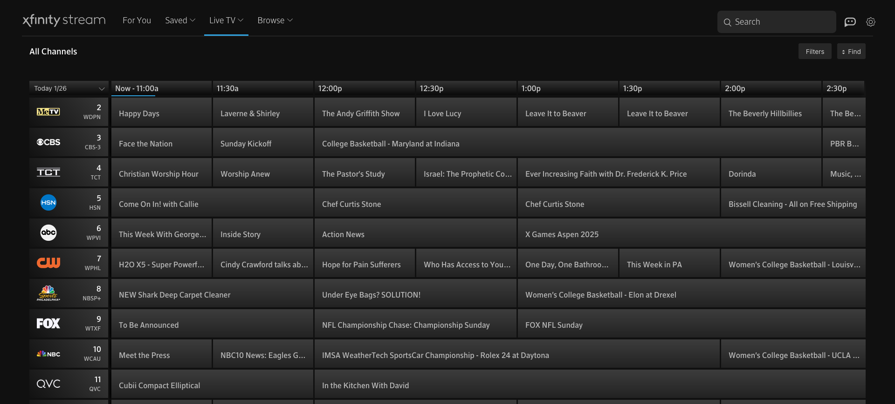

# xClassic for Xfinity Stream
Return the old X1 UI to Xfinity Stream.

# Installation
1. Install [Stylebot](https://github.com/ankit/stylebot)
2. Once installed, go to the options menu, then styles
3. Add a style for `xfinity.com/stream`
4. Paste the following: `@import url(https://raw.githubusercontent.com/Nodysey/xclassic/refs/heads/main/xclassic.css)`

